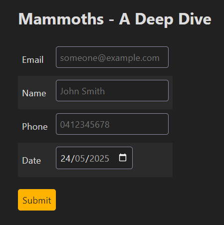
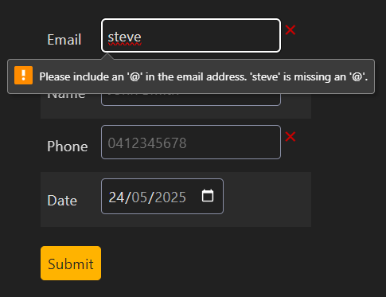
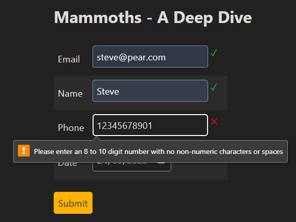
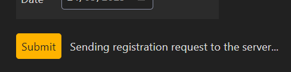
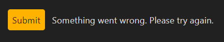
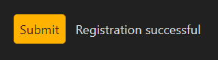
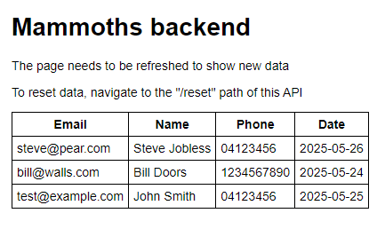

Small test project for a potential job opportunity

The brief was to create a mock event registration form, collecting and validating the following information from a user: 
- Email
- Name
- Phone number
- Date of the event they're registering for (from 24th-26th of May)

The project should implement both frontend and backend - I chose a React/Express stack since I'm most experienced with those technologies. 

My general approach was to create all needed functionality without reinventing the wheel. HTML forms and inputs already allow for client-side data entry and validation for these data types (and are standardised and supported by all major browsers, including their accessibility and autofill features), so that was my starting point. Client-side validation stops the user from submitting an invalid form in normal use, but to protect from edge cases or if an http request was sent without using the form, the backend is also equipped with data validation. 

The backend is minimal - when receiving a POST request, validate the data and either reject and send a 400 response, or save to the database and send a 200 response. A GET request to the home route will display all the data, while sending a request to the /reset route will clear all data. Obviously these last two routes would not be implemented this way in a real environment, but they exist for testing purposes. The database itself is handled by Enmap, which allows an SQLite3 database to be abstracted into javascript objects for simplicity (and also hedges against SQL injections). There are only very basic security protections (using Helmet), as this was not part of the brief. 

I wasn't entirely satisfied with the default validation error messages, especially for phone number. I added some empty spans at the end of each input to be displayed if the user attempted to submit invalid data. CSS pseudo-elements were used to fill these with a green check or red cross, making it very obvious which fields are correct and which are not. The default messages for invalid emails are adequate ("Please include an '@'..." etc.), but the one for phone numbers was very ambiguous and was replaced with a message that specified the correct format. If this wasn't just a toy application, I would probably overhaul the validation from scratch to have more control over the style and content of the messages and when they are displayed, but they are good enough for this context. 

The client also contains a field to inform the user of the status of their submission. Once a valid request is sent, it will show a "pending" message, and then will switch to a "success" or "error" message depending on server response (or lack thereof). The error message is generic ("Something went wrong"), but could easily be improved to be more specific (e.g. timeout, validation error). I also considered having the server send a specific error for duplicate submissions ("You're already registered") but this would be fairly trivial yet time-consuming, so I chose not to. 

The only specification for styling was "Simple, clean and professional" and "responsive on different screen sizes" so I used SimpleCSS and called it a day. 

The client form

Email validation failure

Phone validation failure (custom message)

Pending submission

Error (timeout)

Success

Backend display

